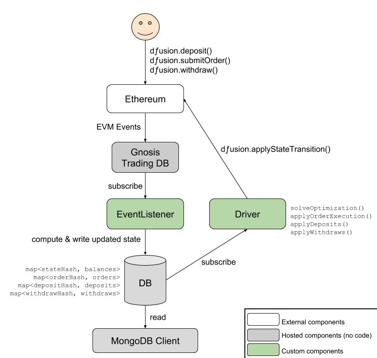

[](https://travis-ci.org/gnosis/dex-services)

## Intro

This repository contains the backend logic for the dfusion exchange based on the specification, see [here](github.com/gnosis/dex-research)

## Architecture

<p align="center">
  
</p>

The *Event Listener* registers for certain EVM events via the [Gnosis Trading DB](https://github.com/gnosis/pm-trading-db).
The [dex smart contract](https://github.com/gnosis/dex-contracts) emits these events on user interaction (deposit, withdraw, order) as well as when the saved state root hash is updated (state transitions).

Upon receiving a relevant event from the contract, the event listener computes the implied changes to the underlying state. 
E.g. if a *deposit* event is received, the list of pending deposits is updated.
Similarly, if a *deposit state transition* event is received it updates the account balances based on the pending deposits that were included in the state transition.

The *Driver* watches state updates to the database and reads relevant data from the smart contract to decide when a state transition can be applied.
There are four types of state transitions:

- apply deposit
- apply withdraws
- find solution for optimization problem
- apply trade execution (according to the winning solution)

The *Driver* computes the updated root state according to the data it reads from the database and submits a state transition to the smart contract.

The *Driver* does not write into the database.
Instead, the smart contract emits an event, which the *Event Listener* receives. The *Event Listener* then applies the state transition based on the data emitted in the event and the existing state in the database.
It also updates the state in the database.

Note that the *Event Listener* is the only component writing into the database.
There are two main reasons for that:
1. **Scalability:** By using the *Single Writer Principle* we can scale access to the database layer much better and thus provide a data availability provider that can also be used by external participants of the system.
2. **Driver Competition:** We assume, there will be multiple systems (or at least multiple instances of this system) competing in optimization and driving the state machine forward. 
Thus, our data layer has to rely only on the data emitted by the EVM. It cannot assume that the *Driver* is aware of updating all available data stores.

More components, e.g. a watchtower to challenge invalid state transitions, will be added in the future.

## Getting Started

### Requirements

- Rust ^1.37
- NodeJS ^11.0, starting with version 12 some deprecated APIs were removed that cause `scrypt`, `keccak`, `secp256k1`, and `sha3` packages to fail to build
- Docker ^19.03 and Docker-compose ^1.24

The project may work with older versions of these tools but they are not tested.

### Installation

Clone the repository, its submodule, and run the container
```bash
git clone git@github.com:gnosis/dex-services.git
cd dex-services
git submodule update --init
cd dex-contracts 
npm install && npx truffle compile
cd ../
docker-compose up
```

This will start:
ganache-cli, the local ethereum chain
postgres, the database storing the data of the snapp
graph-listener, a listener pulling data from the ganache-cli and inserting it into postgres
driver, a service calculating the new states and push these into the smart contract

You can see the current state of the theGraph DB by opening [localhost:8000](http://localhost:8000) and connecting to the default database (top right).
On the left side bar, under *Collections* select the collection you want to inspect, e.g. *accounts*.

In order to setup some testing accounts and make the first deposits (from account 3, of the third registered token with an amount of 18), run in the same repo the following scripts:

```bash
cd dex-contracts
npx truffle exec scripts/{snapp,stablex}/setup_environment.js
npx truffle exec scripts/{snapp,stablex}/deposit.js --accountId=1 --tokenId=1 --amount=18
npx truffle exec scripts/wait_seconds.js 181
```

To claim back the deposit, submit a withdraw request:

```bash
npx truffle exec scripts/{snapp,stablex}/request_withdraw.js --accountId=1 --tokenId=1 --amount=18
```

After 20 blocks have passed, the driver will apply the state transition and you should be able to claim back your funds:

```bash
npx truffle exec scripts/wait_seconds.js 181
npx truffle exec scripts/{snapp,stablex}/claim_withdraw.js --slot=0 --accountId=1 --tokenId=1
```

## Tests

You need the following dependencies installed locally in order to run the e2e tests:
- [jq](https://stedolan.github.io/jq/)

For end-to-end tests, run from the project root:

```bash
docker-compose down && docker-compose up
./test/e2e-tests-deposit-withdraw.sh
./test/e2e-tests-auction.sh
```

If end-to-end tests are failing, check the `docker-compose logs` and consider inspecting the DB state using the web interface.

To run unit tests for the *Driver*:
```bash
cd driver
cargo test --lib
```

## Running with linear optimization solver

For this to work, you will need to have read access to the [solver's gitlab repo](https://gitlab.gnosisdev.com/dfusion/batchauctions). You will also need to have SSH Key authentication for your gitlab account enabled (see [tutorial](https://docs.gitlab.com/ee/ssh/))

In your top-level git folder, create a `.ssh/` folder and move or copy the private and public ssh key (`id_rsa` & `id_rsa.pub`) registered with your gitlab account in there.
Then, run

```sh
docker-compose build --build-arg use_solver=1 driver
```

Afterwards, when you run your environment with `docker-compose up` the linear optimizer should be automatically used. Note that the e2e might no longer work, as their resolution depends on the naive and not the optimal solving strategy.

## Troubleshooting

#### docker-compose build
If you have built the docker landscape before, and there are updates to the smart contracts submodule (*dex-contracts/*), you have to rebuild your docker environment, for them to be picked up:

```bash
cd dex-contracts && rm -rf build && npx truffle compile && cd ..
docker-compose build truffle
```

or rebuild everything if you are desperate (will take longer, but might solve other problems as well)

```bash
docker-compose build
```

#### Different networks:

In order to start StableX for the Rinkeby network, make sure that the env variables in common-rinkeby.env are up to date and then start the specific docker:

```
docker-compose up stablex-rinkeby
```
